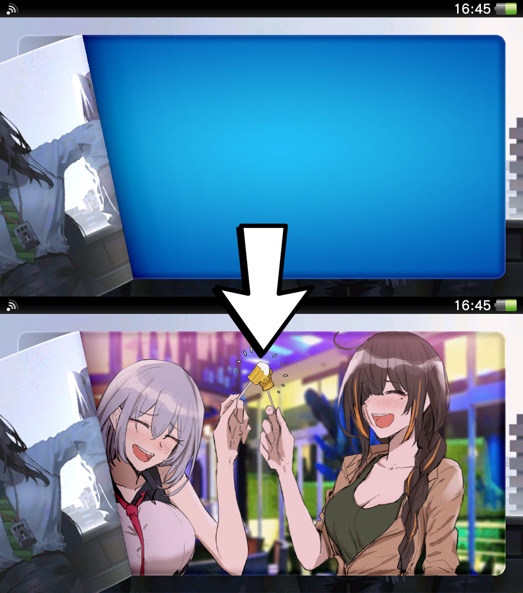

```
Copyright (C) 2019-2021 Reiko Asakura. All Rights Reserved.
Archived from https://git.shotatoshounenwachigau.moe/vita/fruitpeel
```

# Fruitpeel


[Download](https://bin.shotatoshounenwachigau.moe/vita/fruitpeel)

## Installation

Copy fruitpeel.suprx to your Vita and add its path under `*main` in your taiHEN config.txt. Place the background image you want to use at `ur0:/data/fruitpeel.png`.

Note that scaling of the foreground wallpaper (part that peels off) has been disabled due to a bug in the scaling code. If you use a custom foreground wallpaper make sure it is 1020x512.

## Image requirements

PNG with 8 bit palette non-interlaced. Up to a maximum size of 896x448. The file size up to a maximum of 512 KiB.
